# My Budget

> A personal finance management application built in modern C++17, designed with clean architecture, testability, and future extensibility in mind.


---

## Overview

**My Budget** is a desktop application for tracking personal income and expenses. Users can register accounts, organize transactions into categories, and view their financial history — all through a clean Qt6 GUI.

The project follows a layered architecture with strict separation of concerns across models, services, repositories, and validators. The repository abstraction layer is designed to make swapping the in-memory storage for a full SQL database a straightforward step, which is the next major milestone on the roadmap.

---

## Features

### Authentication
- User registration with login and password validation
- Secure login and session management
- Duplicate account prevention

### Transaction Management
- Add income and expense transactions
- Assign transactions to categories
- View full transaction history per user
- Support for recurring transactions (daily, weekly, yearly)
- Optional titles, descriptions, and dates

### Category Management
- Seven built-in global categories: Food, Housing, Transport, Health, Entertainment, Salary, Other
- Custom private categories per user
- Category visibility scoped to the owning user

### User Interface
- Qt6 desktop GUI with a login window and a main transaction window
- Clean, modern stylesheet using a card-based layout
- Transaction history table with real-time refresh
- CLI interface available as an alternative entry point

---

## Architecture

The project is organized into clearly separated layers:

```
include / src
├── models/          — Domain entities: User, Transaction, Category, Budget, Session
├── repositories/    — Interfaces (IUserRepository, etc.) + InMemory implementations
├── services/        — Business logic: AuthService, CategoryService, TransactionService
├── validators/      — Input validation: UserValidator
├── cli/             — Command-line interface: CLIApp, InputHelper
└── gui/             — Qt6 GUI: LoginWindow, MainWindow
```

All services depend on repository **interfaces**, not concrete implementations. This means the storage layer can be replaced (e.g., with SQLite or PostgreSQL) without touching any service or model code.

---

## UML (CLI app version)

The following diagram is designed for CLI App version. The GUI with Qt is slightly different. `CLIApp` -> Windows.

```mermaid
classDiagram

    %% ─────────────────────────────────────────
    %% ENUMS / VALUE TYPES
    %% ─────────────────────────────────────────

    class TransactionType {
        <<enumeration>>
        INCOME
        EXPENSE
    }

    class RecurrenceInterval {
        <<enumeration>>
        NONE
        DAILY
        WEEKLY
        MONTHLY
        YEARLY
    }

    class CategoryType {
        <<enumeration>>
        FOOD
        HOUSING
        TRANSPORT
        HEALTH
        ENTERTAINMENT
        SALARY
        OTHER
    }

    %% ─────────────────────────────────────────
    %% DOMAIN MODELS
    %% ─────────────────────────────────────────

    class User {
        -int id
        -std::string name
        -std::string surname
        -std::string login
        -std::string passwordHash
        +getId() int
        +getUsername() std::string
        +getPasswordHash() std::string
        +getEmail() std::string
        +getCreatedAt() std::string
    }

    class Category {
        -int id
        -std::string name
        -CategoryType type
        -int userId
        +getId() int
        +getName() std::string
        +getType() CategoryType
        +getUserId() int
    }

    class Transaction {
        -int id
        -int userId
        -int categoryId
        -TransactionType type
        -double amount
        -std::string title
        -std::string description
        -std::string date
        -RecurrenceInterval recurrence
        -std::string recurrenceEndDate
        +getId() int
        +getUserId() int
        +getCategoryId() int
        +getType() TransactionType
        +getAmount() double
        +getTitle() std::string
        +getDescription() std::string
        +getDate() std::string
        +getRecurrence() RecurrenceInterval
        +isRecurring() bool
        +getRecurrenceEndDate() std::string
    }

    class Budget {
        -int id
        -int userId
        -int categoryId
        -double limitAmount
        -std::string monthYear
        +getId() int
        +getUserId() int
        +getCategoryId() int
        +getLimitAmount() double
        +getMonthYear() std::string
    }

    class Session {
        -int userId
        -std::string username
        -bool loggedIn
        +getUserId() int
        +getUsername() std::string
        +isLoggedIn() bool
        +clear()
    }

    %% ─────────────────────────────────────────
    %% VALIDATORS
    %% ─────────────────────────────────────────

    class UserValidator {
        +validateLogin(loginToValidation: std::string) bool
        +validatePassword(passwordToValidation: std::string) bool
    }

    class TransactionValidator {
        +validateAmount(amount: double) bool
        +validateDate(date: std::string) bool
        +validateDescription(desc: std::string) bool
        +validateRecurrenceEndDate(start: std::string, end: std::string) bool
    }

    class BudgetValidator {
        +validateLimit(limit: double) bool
        +validateMonthYear(monthYear: std::string) bool
    }

    %% ─────────────────────────────────────────
    %% REPOSITORIES (interfaces)
    %% ─────────────────────────────────────────

    class IUserRepository {
        <<interface>>
        +save(user: User) bool
        +findByUsername(username: std::string) std::optional~User~
        +findById(id: int) std::optional~User~
        +exists(username: std::string) bool
        +update(user: User) bool
    }

    class ITransactionRepository {
        <<interface>>
        +save(tx: Transaction) bool
        +findById(id: int) std::optional~Transaction~
        +findByUser(userId: int) std::vector~Transaction~
        +findByUserAndType(userId: int, type: TransactionType) std::vector~Transaction~
        +findByUserAndCategory(userId: int, categoryId: int) std::vector~Transaction~
        +findRecurring(userId: int) std::vector~Transaction~
        +remove(id: int) bool
        +update(tx: Transaction) bool
    }

    class ICategoryRepository {
        <<interface>>
        +save(cat: Category) bool
        +findById(id: int) std::optional~Category~
        +findByUser(userId: int) std::vector~Category~
        +remove(id: int) bool
    }

    class IBudgetRepository {
        <<interface>>
        +save(budget: Budget) bool
        +findByUserAndMonth(userId: int, monthYear: std::string) std::vector~Budget~
        +findByUserCategoryMonth(userId: int, catId: int, month: std::string) std::optional~Budget~
        +remove(id: int) bool
        +update(budget: Budget) bool
    }

    %% ─────────────────────────────────────────
    %% REPOSITORY IMPLEMENTATIONS
    %% ─────────────────────────────────────────

    class InMemoryUserRepository {
        -std::vector~User~ users
        -int nextId
        +save(user: User) bool
        +findByUsername(username: std::string) std::optional~User~
        +findById(id: int) std::optional~User~
        +exists(username: std::string) bool
        +update(user: User) bool
    }

    class InMemoryTransactionRepository {
        -std::vector~Transaction~ transactions
        -int nextId
        +save(tx: Transaction) bool
        +findById(id: int) std::optional~Transaction~
        +findByUser(userId: int) std::vector~Transaction~
        +findByUserAndType(userId: int, type: TransactionType) std::vector~Transaction~
        +findByUserAndCategory(userId: int, categoryId: int) std::vector~Transaction~
        +findRecurring(userId: int) std::vector~Transaction~
        +remove(id: int) bool
        +update(tx: Transaction) bool
    }

    class InMemoryCategoryRepository {
        -std::vector~Category~ categories
        -int nextId
        +save(cat: Category) bool
        +findById(id: int) std::optional~Category~
        +findByUser(userId: int) std::vector~Category~
        +remove(id: int) bool
    }

    class InMemoryBudgetRepository {
        -std::vector~Budget~ budgets
        -int nextId
        +save(budget: Budget) bool
        +findByUserAndMonth(userId: int, monthYear: std::string) std::vector~Budget~
        +findByUserCategoryMonth(userId: int, catId: int, month: std::string) std::optional~Budget~
        +remove(id: int) bool
        +update(budget: Budget) bool
    }

    %% ─────────────────────────────────────────
    %% SERVICES
    %% ─────────────────────────────────────────

    class AuthService {
        -IUserRepository& userRepo
        -UserValidator validator
        -Session& session
        +registerUser(username: std::string, password: std::string, email: std::string) bool
        +login(username: std::string, password: std::string) bool
        +logout()
        +isLoggedIn() bool
        +getCurrentUser() std::optional~User~
        -hashPassword(password: std::string) std::string
        -verifyPassword(password: std::string, hash: std::string) bool
    }

    class TransactionService {
        -ITransactionRepository& txRepo
        -ICategoryRepository& catRepo
        -TransactionValidator validator
        +addIncome(userId: int, categoryId: int, amount: double, desc: std::string, date: std::string, recurrence: RecurrenceInterval, endDate: std::string) bool
        +addExpense(userId: int, categoryId: int, amount: double, desc: std::string, date: std::string, recurrence: RecurrenceInterval, endDate: std::string) bool
        +editTransaction(id: int, amount: double, desc: std::string, date: std::string) bool
        +deleteTransaction(id: int) bool
        +listAll(userId: int) std::vector~Transaction~
        +listByType(userId: int, type: TransactionType) std::vector~Transaction~
        +listRecurring(userId: int) std::vector~Transaction~
        +getSummary(userId: int, monthYear: std::string) SummaryDTO
    }

    class CategoryService {
        -ICategoryRepository& catRepo
        +addCategory(userId: int, name: std::string, type: CategoryType) bool
        +removeCategory(userId: int, id: int) bool
        +listCategories(userId: int) std::vector~Category~
    }

    class BudgetService {
        -IBudgetRepository& budgetRepo
        -ITransactionRepository& txRepo
        -BudgetValidator validator
        +setBudget(userId: int, categoryId: int, limit: double, monthYear: std::string) bool
        +getBudgetStatus(userId: int, monthYear: std::string) std::vector~BudgetStatusDTO~
        +removeBudget(id: int) bool
    }

    class ReportService {
        -ITransactionRepository& txRepo
        -ICategoryRepository& catRepo
        +monthlySummary(userId: int, monthYear: std::string) MonthlySummaryDTO
        +categoryBreakdown(userId: int, monthYear: std::string) std::vector~CategoryBreakdownDTO~
        +recurringOverview(userId: int) std::vector~Transaction~
        +balanceTrend(userId: int, months: int) std::vector~MonthBalanceDTO~
    }

    %% ─────────────────────────────────────────
    %% DTOs
    %% ─────────────────────────────────────────

    class SummaryDTO {
        +double totalIncome
        +double totalExpense
        +double balance
        +std::string monthYear
    }

    class BudgetStatusDTO {
        +Category category
        +double limit
        +double spent
        +double remaining
        +bool isExceeded
    }

    class MonthlySummaryDTO {
        +std::string monthYear
        +double totalIncome
        +double totalExpense
        +double savings
    }

    class CategoryBreakdownDTO {
        +std::string categoryName
        +TransactionType type
        +double total
        +double percentage
    }

    class MonthBalanceDTO {
        +std::string monthYear
        +double income
        +double expense
        +double balance
    }

    %% ─────────────────────────────────────────
    %% CLI VIEWS
    %% ─────────────────────────────────────────

    class CLIApp {
        -AuthService& authService
        -TransactionService& txService
        -CategoryService& catService
        -BudgetService& budgetService
        -ReportService& reportService
        -Session& session
        +run()
        -showMainMenu()
        -showAuthMenu()
        -showTransactionMenu()
        -showReportMenu()
        -showBudgetMenu()
    }

    class AuthView {
        -AuthService& authService
        +showLoginPrompt()
        +showRegisterPrompt()
        +showLogoutConfirm()
    }

    class TransactionView {
        -TransactionService& txService
        -CategoryService& catService
        +showAddIncomeForm()
        +showAddExpenseForm()
        +showTransactionList(transactions: std::vector~Transaction~)
        +showRecurringList(transactions: std::vector~Transaction~)
        +showEditForm(tx: Transaction)
        +showDeleteConfirm(id: int)
    }

    class BudgetView {
        -BudgetService& budgetService
        +showSetBudgetForm()
        +showBudgetStatus(statuses: std::vector~BudgetStatusDTO~)
    }

    class ReportView {
        -ReportService& reportService
        +showMonthlySummary(dto: MonthlySummaryDTO)
        +showCategoryBreakdown(breakdown: std::vector~CategoryBreakdownDTO~)
        +showBalanceTrend(trend: std::vector~MonthBalanceDTO~)
    }

    class InputHelper {
        +readString(prompt: std::string) std::string
        +readDouble(prompt: std::string) double
        +readInt(prompt: std::string) int
        +readDate(prompt: std::string) std::string
        +readChoice(prompt: std::string, min: int, max: int) int
        +clearScreen()
        +printSeparator()
    }

    %% ─────────────────────────────────────────
    %% RELATIONSHIPS
    %% ─────────────────────────────────────────

    %% Inheritance – repositories
    IUserRepository <|.. InMemoryUserRepository
    ITransactionRepository <|.. InMemoryTransactionRepository
    ICategoryRepository <|.. InMemoryCategoryRepository
    IBudgetRepository <|.. InMemoryBudgetRepository

    %% Services depend on repositories
    AuthService --> IUserRepository
    AuthService --> Session
    AuthService --> UserValidator
    TransactionService --> ITransactionRepository
    TransactionService --> ICategoryRepository
    TransactionService --> TransactionValidator
    BudgetService --> IBudgetRepository
    BudgetService --> ITransactionRepository
    BudgetService --> BudgetValidator
    CategoryService --> ICategoryRepository
    ReportService --> ITransactionRepository
    ReportService --> ICategoryRepository

    %% Services produce DTOs
    TransactionService ..> SummaryDTO
    BudgetService ..> BudgetStatusDTO
    ReportService ..> MonthlySummaryDTO
    ReportService ..> CategoryBreakdownDTO
    ReportService ..> MonthBalanceDTO

    %% CLIApp orchestrates views
    CLIApp --> AuthView
    CLIApp --> TransactionView
    CLIApp --> BudgetView
    CLIApp --> ReportView
    CLIApp --> Session

    %% Views depend on services
    AuthView --> AuthService
    TransactionView --> TransactionService
    TransactionView --> CategoryService
    BudgetView --> BudgetService
    ReportView --> ReportService

    %% Views use InputHelper
    AuthView --> InputHelper
    TransactionView --> InputHelper
    BudgetView --> InputHelper
    ReportView --> InputHelper

    %% Models use enums
    Transaction --> TransactionType
    Transaction --> RecurrenceInterval
    Transaction --> CategoryType
    Category --> CategoryType

    %% Ownership
    Transaction --> User : belongs to
    Budget --> User : belongs to
    Category --> User : belongs to
    Transaction --> Category : categorized by
    Budget --> Category : limits
```




---

## Tech Stack

| Technology | Role |
|---|---|
| C++17 | Core language |
| CMake 3.16+ | Build system |
| Qt 6 | GUI framework |
| GoogleTest | Unit testing |
| GitHub Actions | CI/CD |

---

## Getting Started

### Requirements

- CMake 3.16+
- C++17 compiler (GCC, Clang, or MSVC)
- Qt 6.x (Core + Widgets)

### Build

```bash
git clone https://github.com/your-username/my-budget.git
cd my-budget
cmake -B build
cmake --build build
```

### Run

```bash
./build/SpendingManager
```

### Run Tests

```bash
ctest --test-dir build --output-on-failure
```

---

## Testing

Unit tests are written with **GoogleTest** and cover the core business logic layer. Tests use in-memory fakes for all repository dependencies, keeping them fast and isolated.

Current coverage:

| Suite | Tests |
|---|---|
| `UserValidatorTest` | Login length validation, password length validation |
| `AuthServiceTest` | Registration, duplicate prevention, login success, login failure |
| `CategoryServiceTest` | Default initialization, private category creation, user scoping |
| `TransactionServiceTest` | Valid/invalid amounts, history isolation, amount correctness |

Tests run automatically on every push and pull request via GitHub Actions.


---

## Contributing

This project is a learning and portfolio project. Pull requests and issues are welcome.

---

## Author

Developed as a portfolio project focused on modern C++ software design, clean architecture, and test-driven development.